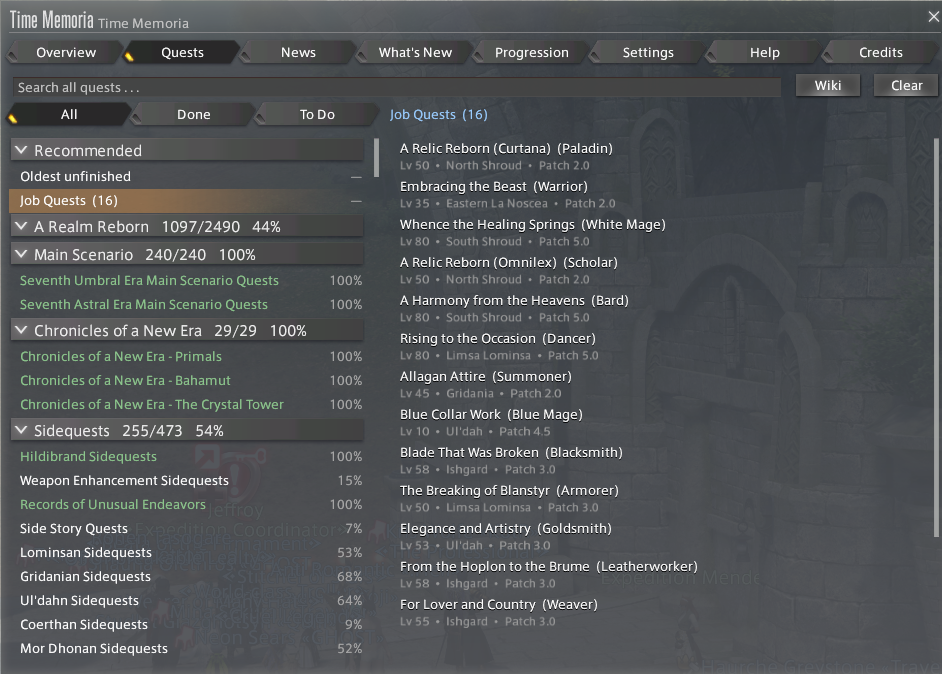
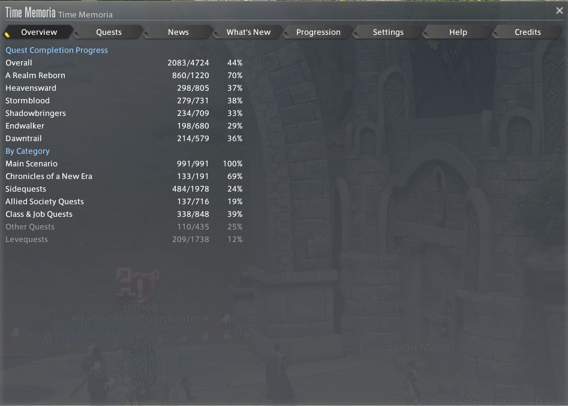
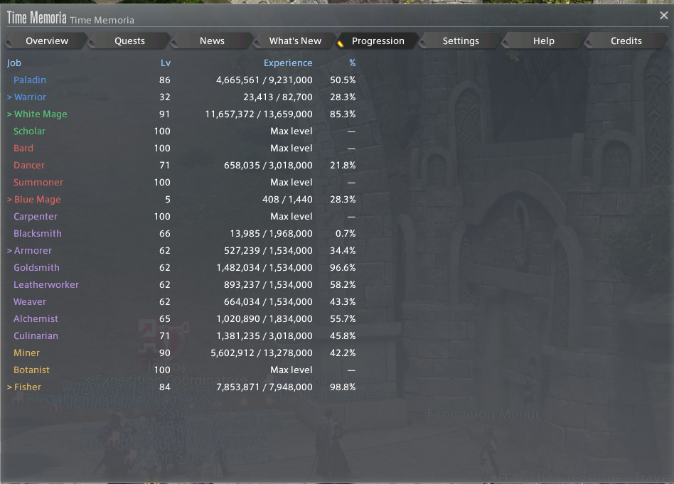
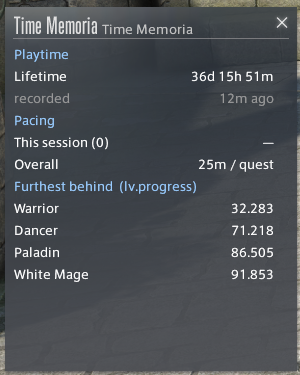

# Time Memoria

A FFXIV Dalamud plugin for quest progression and pacing — a reflective notebook
for your story journey, not a scoreboard.

> ⚠️ This plugin **cannot** be used for ACT/FFLogs-style performance analysis.
> It does not track, read, or evaluate combat performance in any way.



Browse by expansion and section, or let **Recommended** answer "what next" — the
oldest thing outstanding, the next Main Scenario quest, and the next quest for
every job you have actually unlocked. The patch each quest arrived in is not in
the game's own tables; it ships as data.

| | |
|---|---|
|  |  |
| Completion by expansion and by section. Excluded categories stay visible but uncounted. | Class and job levels, coloured by role, marking the least progressed in each. |



A small companion window for while you are actually playing: playtime with the
age of the reading, session and lifetime pacing, and the battle jobs furthest
behind.

Every window above is drawn with the game's own widgets. There is a classic
ImGui version of all of it too — `/tm classic` — and a setting for which one
`/tm` opens.

---

## Status: unreleased

**Time Memoria has never been released.** Nothing has been published and nobody
has installed it — but two earlier versions were built and flown, and this one
releases as **3.0** because it is shaped by what they taught.

[TimeMemoriaV2](https://github.com/LegendsOfTheGame/TimeMemoriaV2) is kept for
reference. It maintained its quest data by hand — 288 JSON files needing an
update every patch — and that is why it stalled: patch 7.5 landed in April 2026
and the data was never added.

This version reads quest data from the game's own journal tables instead, so a
patch's content appears the day it lands and no one has to do anything. That is
the whole point of the rebuild, and it is a direct answer to how the last one
failed. Numbering it 1.0 would hide that.

### Module state

| Module | State |
|---|---|
| Quest UI | ✅ generated from journal tables |
| News / Events | ✅ feed plus client-read festivals |
| Playtime & pacing | ✅ session and lifetime |
| Class & job progression | ✅ with clipboard export |
| Patch attribution | ✅ patch column on quests and What's New |
| Native game windows | ✅ every tab, plus a companion window |
| Ocean Fishing helper | ❌ future |

### Versioning

`MAJOR.MINOR.PATCH.API` — releasing at **`3.0.0.15`**.

The last digit is the Dalamud API level the build targets, so you can tell which
game version a build is for without opening the manifest. It is safe in the last
position: API levels only ever climb, so the version stays monotonic, which
Dalamud requires for updates to install. Putting it *first* would make a routine
API bump look like a major release of the plugin.

Time Memoria v2 used `AA.B.C.D`, where the digits encoded API level, expansion
band, patch band, and how many quest buckets had been hand-extracted. That was
right for a plugin whose central problem was migrating quest data by hand — the
version told you how far through it you were.

This version has no buckets, and covers every expansion and patch the moment the
game does. Under the old scheme it would read `15.7.5.9` on day one and never
move again. The module table above carries what those digits used to.

### What works

- Quest data generated from the game's own journal tables — no hand-maintained
  quest files, so a patch's content appears the day it lands
- Two-panel questline tree, chain-grouped, with search across every expansion
  including ones the tree is hiding
- Suggested next quest, and per-expansion and per-category progress
- The patch each quest arrived in — not in the game files at all, so it ships
  as data
- MSQ progression gating, spoiler mode, free-trial mode
- Class and job levelling, role-coloured, with clipboard export
- Playtime pacing, session and lifetime
- World state: maintenance windows, patch status, and active events read from
  the client rather than only from the news feed
- What's New — quests added since the baseline snapshot, with the build they
  arrived in
- Per-character completion dates from first install onwards
- Help and Credits

---

## Building

Native UI comes from [KamiToolKit](https://github.com/MidoriKami/KamiToolKit),
which is not published as a package — it is a submodule, and **the build will
fail without it**:

```
git clone --recurse-submodules https://github.com/LegendsOfTheGame/TimeMemoriaV3
```

Already cloned? `git submodule update --init --recursive`, then:

```
dotnet build TimeMemoria.csproj
```

Requires the .NET 10 SDK and a Dalamud development environment.

The assembly is named `TimeMemoriaV3` permanently. Dalamud derives InternalName
from it, and InternalName keys the configuration file and the directory holding
the quest journal — renaming it would orphan both. Only the display name matters
to anyone using the plugin, and that is `Time Memoria`.

---

## Credits

Time Memoria's quest data layer derives from **QuestTracker**, originally by
[isaiahcat](https://github.com/isaiahcat/QuestTracker) and currently maintained
by [keifufu](https://github.com/keifufu/QuestTracker), used under AGPL-3.0. It
is an independent plugin, not affiliated with or endorsed by either author.

See [NOTICE](NOTICE) for the full attribution and the list of changes.

Inspiration, though no code, also came from
[BetterPlaytime](https://github.com/caitlyn-gg/BetterPlaytime) by Infi and
Caitlyn, and [LeveHelper](https://github.com/Haselnussbomber/LeveHelper) by
Haselnussbomber.

---

## Compliance

Time Memoria is strictly a quest progression and pacing tool.

It does **not**:

- Read or display DPS, HPS, deaths, wipes, or duty results
- Integrate with ACT, FFLogs, or any combat log format
- Automate any in-game interaction
- Transmit your data anywhere — the clipboard export is local and user-initiated

Saved data is limited to quest IDs, completion counts, timestamps, pacing
aggregates, and class/job levels. Nothing it stores can be repurposed as a
combat log.

---

## AI usage

Development was AI-assisted at the **Copilot** level as defined by Dalamud's
[AI Usage Policy](https://dalamud.dev/plugin-publishing/ai-policy/) — AI
implements, the maintainer plans, tests and reviews. No assets are AI-generated.

[AI-DECLARATION.md](AI-DECLARATION.md) records this in full, including what AI
got wrong and how it was caught.

---

## Licence

[AGPL-3.0](LICENSE).
